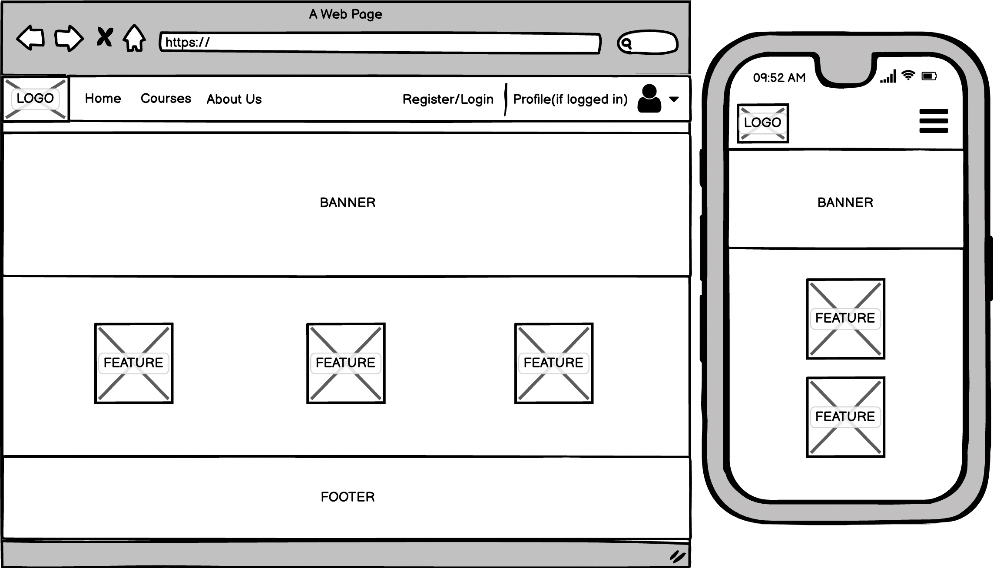
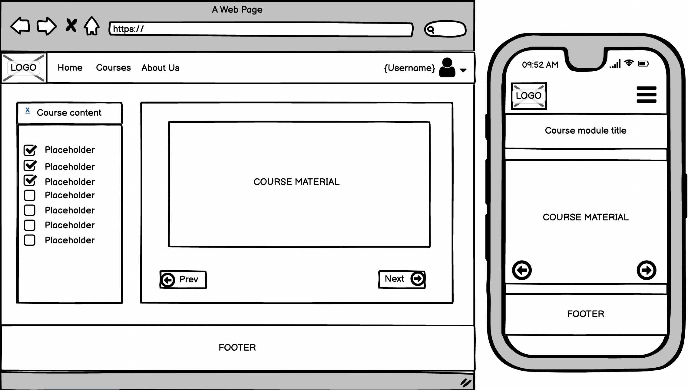
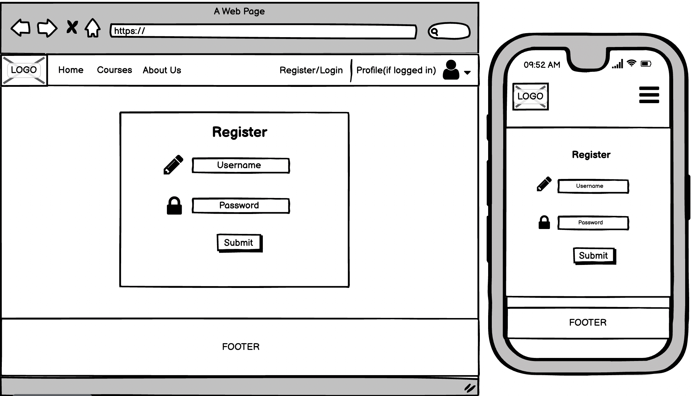
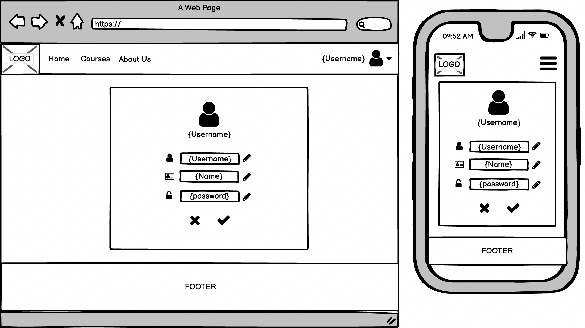
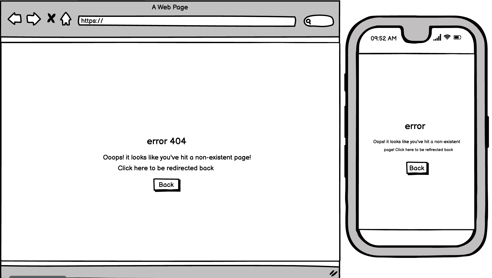

## Table of Contents
* [User Experience Design (UX)](#User-Experience-Design)
    * [The Strategy Plane](#The-Strategy-Plane)
        * [Site Goals](#Site-Goals)
        * [User stories](#User-Stories)
    * [The Scope Plane](#The-Scope-Plane)
    * [The Structure Plane](#The-Structure-Plane)
    * [The Skeleton Plane](#The-Skeleton-Plane)
        * [Wireframes](#Wireframes)
        * [Database Design](#Database-Design)
        * [Security](#Security)
    * [The Surface Plane](#The-Surface-Plane)
        * [Design](#Design)
            * [Colour Scheme](#Colour-Scheme)
            * [Typography](#Typography)
            * [Imagery](#Imagery)
    * [Differences to Design](#Differences-to-Design)
- [Features](#Features)
    * [Existing Features](#Existing-Features)
    * [Future Features](#Features-Left-to-Implement)
* [Technologies](#Technologies)
* [Testing](#Testing)
    * [Test Strategy](#Test-Strategy)
    * [Test Results](#Test-Results)
    * [Isses and Resolutions](#Issues-and-Resolutions-to-issues-found-during-testing)
* [Deployment](#Deployment)
    * [Project Creation](#Project-Creation)
    * [GitHub Pages](#Deployment-To-Heroku)
    * [Run Locally](#Run-Locally)
    * [Fork Project](#Fork-Project)
* [Credits](#Credits)
  * [Content](#Content)
  * [Acknowledgements](#Acknowledgements)

****

## User Experience Design
### **The Strategy Plane**

This project focuses on providing a well-structured, digestible approach to technical analysis in an introductory course format targeted at beginners. Learners will receive an introduction to the world of trading looking in-depth at the importance of technical analysis. (Add another thing they will learn)

We start with a beginner’s guide to the financial marketplace; from there we take a deeper look at… This will provide a comprehensive overview of the fundamentals of technical analysis and prepare the user to progress through further intermediate studies.

#### Site Goals
* To help users understand technical analysis and why it's an important fundamental when learning to trade
* To provide an easy to use web application from start to finish
* To provide a service for the user to easily interact with the course material 
* To provide an in depth introduction to technical analysis in a well presented, easy to read fashion

#### User stories
* As a user, I want the website to be responsive so that I can clearly view the webpages from my mobile, tablet or desktop
* As a user, I want to be able to register to the website so that my details can be saved
* As a user, I want the main purpose of the site to be clear so that I immediately know what the site is intended for upon entering
* As a user, I want to be able to search/filter modules so that i can easily find what I'm looking for
* As a user, I want to effortlessly be able to navigate the site so that I can find content quickly with ease
* As a user, I want to be able to return to the main site without having to use the browser buttons so that I can easily return to the website if I navigate to a page that doesn't exist

### **The Scope Plane**

**Features planned:**
* Responsive design
* CRUD Functionality
* Login functionality
* Logout functionality
* Profile Page
* Website title and information on the site to represent the product
* A MongoDB database to store user login/profile information
* Course module material displayed to registered users with the ability to search and filter through the data
* Registered user profile management including customization
* Navigation Menu (Site Wide)

### **The Structure Plane**
User Story:
> As a user, I want the website to be responsive so that I can clearly view the webpages from my mobile, tablet or desktop

Acceptance Criteria:
* Site must work on all device sizes without loss of design/information flow

Implementation:

The website will be designed mobile first, ensuring all content and webpages work flawlessly with any given device

User Story:
> As a user, I want to be able to register to the website so that my details can be saved for later use

Acceptance Criteria:
* A way for users to register an account 

Implementation:

Users will easily be able to create an account at all times regardless to where they are within the web application

User Story:
> As a user, I want to easily navigate the site so that I can find content quickly with ease.

Acceptance Criteria:
* Navigation menu to be displayed on all pages
* All navigation links redirect to the correct pages

Implementation:

A navigation menu will be displayed on all webpages. This will redirect users to the appropriate page when clicked. On smaller devices, the menu will collapse into a hamburger menu to make efficient use of screen 
space.

The navigation menu will contain the following items:

* Home - index.html
* Register - register.html
* Sign In - login.html
* Profile - profile.html
* Courses - courses.html
* About Us - about.html
* Sign Out - (redirects to home page)

User Story:
> As a user, I want to be able to register to the website so that I can create/manage my account

Acceptance Criteria:
* Sign up - Login and Logout functionality to be added
* User must have the ability to create, update and delete their profile attributes
* User must have a profile page displaying their basic details and courses they're currently on

Implementation:

A Registration page will be implemented that allows users to register for an account on the website. The username and password along with basic details for the users account will be stored in a MongoDB database collection called users

A Sign In page will be implemented to allow registered users the ability to login in to their account

Once a user has successfully logged in, they will be redirected to the home page page. The user will be able to edit their profile easily by clicking on their profile icon at the top-right of the navigation menu, allowing them to easily edit and change any information about themselves updating the records on the database. 

A Sign Out button will be displayed to users who are logged in. When clicked this will sign the user out of the website and redirect them to the home page.

A flash message will be shown to the user to alert them whether the task they have started has been successful or not, this includes the following:

* Logging into the website
* Logging out of the website
* Registering an account on the website
* Updating profile attributes
* Deleting profile

> As a user, I want the main purpose of the site to be clear so that I immediately know what the site is intended for upon entering

Acceptance Criteria:
* Information displayed about the website clearly to new users to indicate what the purpose of the website is

Implementation:
A banner with a background image will be presented on the home page to show to users what the website is about and who it's target audience is

>As a user, I want to be able to search/filter modules so that i can easily find what I'm looking for

Acceptance Criteria:
* A function to support searching through an index of modules listed on the website

Implementation:
A search bar will be implemented on the websites courses page (courses.html) to allow the user to search for a given module on a specific course they might be looking for, directing them to the course page the module they searched for contains

User Story:
> As a user, I want to be able to return to the main site without having to use the browser buttons so 
that I can easily return to the website if I navigate to a page that doesn't exist.

Acceptance Criteria:
* If a user redirects to the wrong page, an error will display that contains a link to go back to the main website.

Implementation:

A custom 404 page will be created so that if a user attempts to navigate to a page that it not found, an 
error will be displayed. This page will contain a link to allow the user to redirect back to the main website without needing to use the browser navigation buttons.

### **The Skeleton Plane**
#### Wireframes

Home:
 
Course:
 
Register:
 
Sign-In:
 
Profile:
 
About Us:
 
404:
 

**Original Design Wireframes (PDF)**
* [Home](static/images/readme/wireframes/pdf/home.pdf)
* [Course](static/images/readme/wireframes/pdf/course.pdf)
* [Register](static/images/readme/wireframes/pdf/register.pdf)
* [Sign-In](static/images/readme/wireframes/pdf/sign-in.pdf)
* [Profile](static/images/readme/wireframes/pdf/profile.pdf)
* [About-Us](static/images/readme/wireframes/pdf/about-us.pdf)
* [404](static/images/readme/wireframes/pdf/404.pdf)

#### Security

Database connection details are set up in an [env.py](https://pypi.org/project/env.py/) for development, for 
security reasons this is not uploaded to GitHub so that database and connection details are not visible to 
users. In production these are stored in Heroku. 

## **The Surface Plane**
### Design

#### Colour Scheme
TO BE FILLED IN

#### Typography
TO BE FILLED IN

#### Imagery
TO BE FILLED IN

## Differences to Design
TO BE FILLED IN

## Features

#### Existing Features
TO BE FILLED IN

### Features Left to Implement
* Additional courses added to the website 
* Functionality to support course search/filtering 
* A comments section for each course to leave feedback

****

## Technologies
* [HTML](https://en.wikipedia.org/wiki/HTML)
	* This project uses HTML as the main language used to complete the structure of the Website
* [CSS](https://en.wikipedia.org/wiki/CSS)
	* This project uses custom written CSS to style the website
* [JavaScript](https://en.wikipedia.org/wiki/JavaScript)
    * JavaScript is used for basic DOM manipulation & scripting
* [jQuery](https://jquery.com/)
    * jQuery is a JavaScript framework used for basic UI functionality
* [Python](https://www.python.org/)
    * This projects core was created using Python, the back-end logic and the means to run/view the Website
    * Python Modules used (These can be found in the requirements.txt project file):
         * cachetools==4.2.2
         * certifi==2021.5.30
         * charset-normalizer==2.0.4
         *  click==8.0.1
         * dnspython==2.1.0
         * Flask==2.0.1
         * Flask-PyMongo==2.3.0
         * google-auth==1.34.0
         * google-auth-oauthlib==0.4.5
         * gspread==4.0.0
         * idna==3.2
         * itsdangerous==2.0.1
         * Jinja2==3.0.1
         * MarkupSafe==2.0.1
         * oauthlib==3.1.1
         * pyasn1==0.4.8
         * pyasn1-modules==0.2.8
         * pymongo==3.12.0
         * requests==2.26.0
         * requests-oauthlib==1.3.0
         * rsa==4.7.2
         * six==1.15.0
         * urllib3==1.26.6
         * Werkzeug==2.0.1
* [MongoDB](https://www.mongodb.com/1)
    * MongoDB was used to create the document based databases(collections) used as data storage for this project
* [Balsamiq Wireframes](https://balsamiq.com/wireframes/)
	* This was used to create wireframes for 'The Skeleton Plane' stage of UX design
* [Google Fonts](https://fonts.google.com/)
	* Google fonts are used throughout the project to import the *Inter* and *Bevan* fonts
* [GitHub](https://github.com/)
	* GithHub is the hosting site used to store the source code for the Website
* [Git](https://git-scm.com/)
	* Git is used as version control software to commit and push code to the GitHub repository where the source code is stored
* [Heroku](https://dashboard.heroku.com/apps)
    * Heroku was used to deploy the live website
* [Google Chrome Developer Tools](https://developers.google.com/web/tools/chrome-devtools)
	* Google chromes built in developer tools are used to inspect page elements and help debug issues with the site layout and test different CSS styles
* [Materialize](https://materializecss.com/)
    * The Materialize framework was used through the website for layout and responsiveness
* [Canva](https://www.canva.com/)
    * Canva design was used in order to create the logo
* [Font Awesome](https://fontawesome.com/)
    * All the Icons displayed throughout the website are Font Awesome icons

****
## Testing

### Test Strategy
#### **Summary**
**"Testing is required on all features and user stories documented in this README All clickable links must redirect to the correct pages. All forms linked to MongoDB must be tested to ensure they insert all given fields into the correct collections"**

HTML Code must pass through the [W3C HTML Validator](https://validator.w3.org/#validate_by_uri)

CSS Code must pass through the [W3C CSS Validator](https://jigsaw.w3.org/css-validator/)

JavaScript code must pass through the [JSHint Validator](https://jshint.com/)

Python Code must pass through [PEP8 Validator](http://pep8online.com/)

#### **High Level Test Cases**
TO BE FILLED IN

#### **Access Requirements**
Tester must have access to MongoDB in order to manually verify the insertion 
of records to users and events collections

#### **Assumptions and Dependencies**
Testing is dependent on the website being deployed live on Heroku

### Test Results

TO BE FILLED IN

### Project Creation

**Note: The project will not run locally with database connections unless the user sets up an [env.py](https://pypi.org/project/env.py/) file configuring IP, PORT, 
MONGO_URI, MONGO_DBNAME and SECRET_KEY. You must have the connection details in order to do this. These details are private and not disclosed in this repository for security purposes.**

### Local deplyoment

1. Click on the green 'code' button on the repository
1. Select one of two options 'Download as ZIP', 'Open with GitHub Desktop'
1. If 'Download as ZIP' has been chosen, follow the steps below:
1. Once the folder has been downloaded, un-ZIP the folder using a third-party application like WinZip, WinRAR
1. Open the unzipped folder into your IDE (integrated development environment)
1. For VSCode users, you can download the 'Live server' plugin and launch the project using a local server
1. For users using any other IDE you will need to find out how to launch this project on the respective IDE
1. Open your IDE of choice then open its terminal window (CLI) and locate the projects directory
1. Use the 'git clone' command in the terminal followed by the copied git URL
1. A clone of the project will be created locally on your machine.

### Deployment to Heroku

**Create application:**
1. Navigate to Heroku.com and login
1. Click on the new button
1. Select create new app
1. Enter the app name
1. Select region

**Set up connection to Github Repository:**

1. Click the deploy tab and select GitHub - Connect to GitHub
1. A prompt to find a github repository to connect to will then be displayed
1. Enter the repository name for the project and click search
1. Once the repo has been found, click the connect button

**Set environment variables:**

Click the settings tab and then click the Reveal Config Vars button and add the following:

1. key: IP, value: 0.0.0.0
2. key: PORT, value: 5000
3. key: MONGO_DBNAME, value: (database name you want to connect to)
4. key: MONGO_URI, value: (mongo uri - This can be found in MongoDB by going to clusters > connect > connect to your application and substituting the password and 
    dbname that you set up in the link).
5. key: SECRET_KEY, value: (This is a custom secret key set up for configuration to keep client-side sessions secure).

**Enable automatic deployment:**
1. Click the Deploy tab
1. In the Automatic deploys section, choose the branch you want to deploy from then click Enable Automation Deploys.

### Fork Project 

Forks are used to either propose changes to someone else's project or to use someone else's project as a starting point 
for your own idea. - Definition from [Github Docs](https://docs.github.com/en/free-pro-team@latest/github/getting-started-with-github/fork-a-repo).

1. Navigate to the GitHub Repository you want to fork.
1. On the top right of the page under the header, click the fork button.
1. This will create a duplicate of the full project in your GitHub Repository.

****

## Credits
[CodingLab](https://www.youtube.com/watch?v=wEfaoAa99XY&list=LLtq7zXJyPFDANiQE5jmtrdg&index=1)
This website uses the HTML/CSS sidebar navigation linked in the description of the video linked above

### Acknowledgements
TO BE FILLED IN

****

