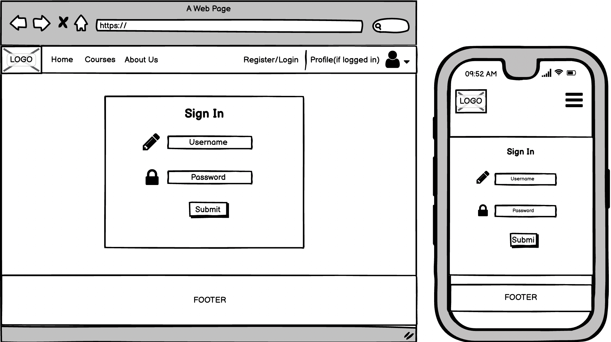
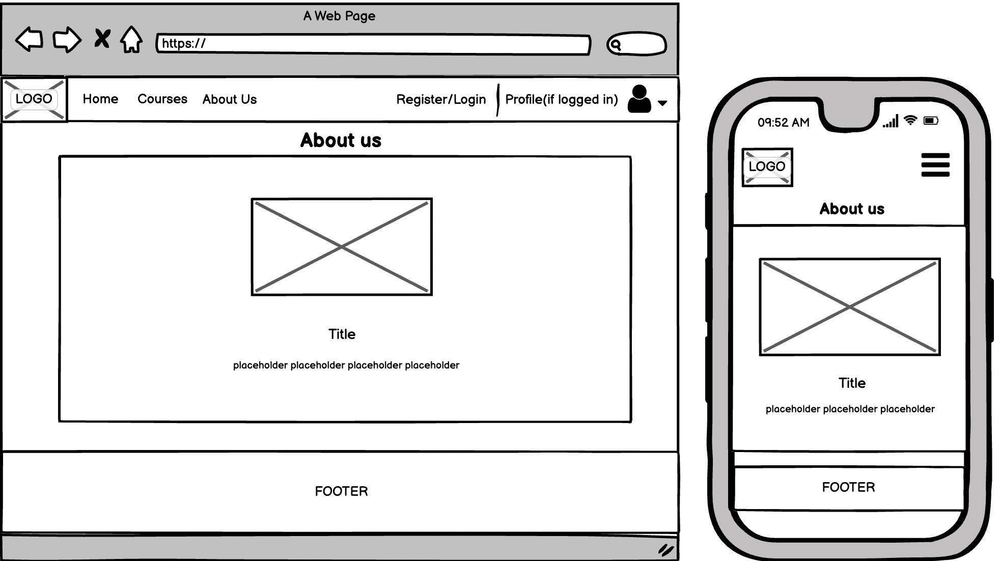

## Technologies
* [HTML](https://en.wikipedia.org/wiki/HTML)
	* This project uses HTML as the main language used to complete the structure of the Website.
* [CSS](https://en.wikipedia.org/wiki/CSS)
	* This project uses custom written CSS to style the Website.
* [JavaScript](https://en.wikipedia.org/wiki/JavaScript)
    * JavaScript is used for basic DOM manipulation & scripting
* [jQuery](https://jquery.com/)
    * jQuery is a JavaScript framework used for basic UI functionality
* [Python](https://www.python.org/)
    * This projects core was created using Python, the back-end logic and the means to run/view the Website.
    * Python Modules used (These can be found in the requirements.txt project file):
        * dnspython==2.0.0
        * Flask==1.1.2
        * Flask-PyMongo==2.3.0
        * Flask-WTF==0.14.3
        * pymongo==3.11.2
        * Werkzeug==1.0.1
* [MongoDB](https://www.mongodb.com/1)
    * MongoDB was used to create the document based databases(collections) used as data storage for this project.
* [Materialize](https://materializecss.com/)
    * The Materialize framework was used through the website for layout and responsiveness.
* [Google Fonts](https://fonts.google.com/)
	* Google fonts are used throughout the project to import the *Inter* and *Bevan* fonts.
* [GitHub](https://github.com/)
	* GithHub is the hosting site used to store the source code for the Website.
* [Git](https://git-scm.com/)
	* Git is used as version control software to commit and push code to the GitHub repository where the source code is stored.
* [Heroku](https://dashboard.heroku.com/apps)
    * Heroku was used to deploy the live website.
* [Google Chrome Developer Tools](https://developers.google.com/web/tools/chrome-devtools)
	* Google chromes built in developer tools are used to inspect page elements and help debug issues with the site layout and test different CSS styles.
* [Balsamiq Wireframes](https://balsamiq.com/wireframes/)
	* This was used to create wireframes for 'The Skeleton Plane' stage of UX design.
* [Canva](https://www.canva.com/)
    * Canva design was used in order to create the website logo.
* [Font Awesome](https://fontawesome.com/)
    * All the Icons displayed throughout the website are Font Awesome icons.

Home:
 
Course:
 
Register:
 
Sign-In:
 
Profile:
 
About Us:
 
404:
 

**Original Design Wireframes (PDF)**
* [Home](static/images/readme/wireframes/pdf/home.pdf)
* [Course](static/images/readme/wireframes/pdf/course.pdf)
* [Register](static/images/readme/wireframes/pdf/register.pdf)
* [Sign-In](static/images/readme/wireframes/pdf/sign-in.pdf)
* [Profile](static/images/readme/wireframes/pdf/profile.pdf)
* [About-Us](static/images/readme/wireframes/pdf/about-us.pdf)
* [404](static/images/readme/wireframes/pdf/404.pdf)

